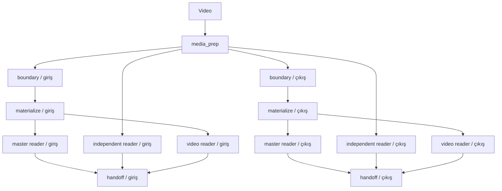

# Sheriff — Allstar Orkestra Şefi

Sheriff, Allstar kulelerinin kontrol düzlemidir. Bir videoyu hazırlar, bölüm
bazlı DAG'ı yürütür, bağımsız kuleleri yalnız kamuya açık CLI'leriyle çağırır
ve doğrulanmış üç okuyucu paketini Shaq inbox'ına teslim eder.

Sheriff hiçbir kardeş kulenin Python kodunu import etmez. Eski MITAS pipeline,
flow queue, `scripts/` veya `core/` altında bir çalışma zamanı bağımlılığı yoktur.
Kule değişimi [`config.yaml`](config.yaml) içindeki mantıksal rol kaydıyla yapılır.
Sheriff, kule executable'larının ve sürüm dosyalarının `Allstar/` içinde
kalmasını config yüklenirken zorunlu kılar. Varsayılan dört kule de kendi yerel
venv'iyle çalışır.

## Akış



Fiziksel varsayılan kayıtlar boundary=Kobe, master reader=LeBron,
independent frame reader=Nash ve video reader=Jordan'dır. DAG bu fiziksel
adları bilmez.

Kobe `KREDI_YOK` döndürürse yalnız ona bağlı materialize, master-reader ve
video-reader kanalları `NO_CONTENT` olur. Bağımsız okuyucu çalışmaya devam
eder. Handoff üç kanal terminal olduktan sonra her kanalın durumunu açıkça
yazar. Sheriff Shaq/Hakeem karar motorunu başlatmaz.

## Kurulum ve CLI

```bash
cd /opt/mitas/Allstar/sheriff
./venv_kur.sh
./sheriff doctor
./sheriff enqueue --video /veri/Titanik.mkv --film-id titanik --title Titanic
./sheriff run
./sheriff status --film-id titanik
```

Toplu kuyruk ve servis biçimi:

```bash
./sheriff enqueue --input /veri/filmler
./sheriff start
./sheriff stop
./sheriff stop --force
./sheriff retry --film-id titanik --task reader_master
```

Aynı film kimliği + kaynak SHA-256 + pipeline sürümü yeniden enqueue edilirse
mevcut `run_id` döner. Pipeline sürümü yalnız elle yazılan etiketten ibaret
değildir; Sheriff kodu/şemaları, registry, aktif kule kodu/ayarları, pin/kurulum
tanımları ve küçük model manifestleri hash'e girer. `doctor`, her aktif kulede
kurulu paketlerin `gereksinimler.txt` pinleriyle birebir eşleşmesini ve
`pip check` sonucunu da doğrular. Bilinçli yeniden çalışma için `--force` yeni
bir run oluşturur. Diskteki kod daemon çalışırken değişirse eski kimlikle yeni
kod koşturulmaz; görev `BLOCKED_CONTRACT` olur ve Sheriff yeniden başlatılır.

## Kalıcı durum ve crash recovery

`state/sheriff.sqlite3` SQLite/WAL kullanır. Film, run, görev, bağımlılık,
deneme, artefakt, kaynak rezervasyonu ve olay tabloları tek transaction sınırı
içindedir. Her görev `run_id`, `task_id`, `attempt_id`, input hash'i ve pipeline
sürümü taşır.

`RUNNING` görevleri lease/heartbeat taşır. Sheriff yeniden başladığında bayat
lease'in çıktısı önce marker, JSON ve run/task/attempt kimliğiyle doğrulanır.
Geçerliyse aynı deneme kurtarılır; geçersizse deneme `ABANDONED` kapanır ve
temiz retry yapılır. Kuleler yalnız kendi `Allstar/<kule>/out/` alanına yazar;
Sheriff çalıştırmadan önce aynı film/bölümdeki bayat çıktıyı deneme arşivine
alır. Taze çıktı doğrulandıktan sonra hardlink/kopya ile
`runs/<film>/<run>/tower_outputs/<rol>/<attempt_id>/<film>/<bolum>/` snapshot'ı
oluşturulur ve aşağı akış bu değişmez kopyayı tüketir. Media, materialize ve
handoff da kendi hash/manifestlerini doğrulayıp yeniden kullanır. Böylece bayat
`_TAMAM` başarı sayılmaz ve kulenin normal `out/` görünümü korunur.

Lease taraması yalnız başlangıçta değil daemon döngüsünde sürekli yapılır.
Terminal göreve ait kalmış kaynak rezervasyonları otomatik kapatılır; kaydı
alınıp worker bağlanamayan görev tekrar `READY` yapılır.

`_TAMAM` yalnız bütün dosyaların yazımının bittiğini söyler. Başarı her zaman
JSON içeriği, film/bölüm/run/task/attempt kimliği ve asset hash'leri üzerinden
kararlaştırılır.

## Media prep

Sheriff kaynağın SHA-256, ffprobe stream/codec künyesi, süre, çözünürlük ve fps
bilgisini çıkarır. Ses varsa 16 kHz mono PCM WAV üretir; yoksa `ABSENT` yazar.
Native çözünürlükte 2 fps ilk 240 ve son 480 saniye ayrı havuzlardır. Kısa
filmde zaman aralıkları çakışsa da iki `frames.jsonl` ayrı kalır.

Her frame kaydı dosya adı, sıra, kaynak zamanı, bölüm zamanı, boyut ve SHA-256
taşır. FFmpeg çağrıları shell kullanmaz, ayrı process group'undadır ve geçici
dizin başarıyla bitmeden görünür çıktıya atomik taşınmaz.

## Proof ve veri biçimi

Ortak sözleşme `mitas.okuma/v2`'dir; JSON şeması
[`schemas/okuma-v2.schema.json`](schemas/okuma-v2.schema.json) altındadır.

- SQLite kontrol durumunu, JSON sürümlü sonuçları, JSONL frame/olay akışını taşır.
- PNG/MP4/WAV JSON'a gömülmez; yol, SHA-256 ve teknik künye ile asset olur.
- Ham metin ve normalize metin ayrı alanlardır.
- BBox yalnız piksel `xyxy` ve tam sayı olarak kabul edilir.
- `proof=COMPLETE`, her satır için gerçek asset üzerinde bbox + frame sıra
  numarası + kaynak timecode bulunmadan kabul edilmez.
- BBox bulunamazsa satır silinmez veya bbox uydurulmaz; proof `PARTIAL/NONE` olur.
- Elenen satırlar, okunamayan bölgeler ve proof eksikleri ayrıca korunur.

LeBron ve Nash'in birincil OCR stratejileri sözleşme uyumlu tutuldu.
`MITAS_OKUMA_V2=1` ile aynı modelde ikinci grounding geçişi çalışır. Grounding
çıktısı `eval` olmadan güvenli ayrıştırılır. BBox yalnız exact veya Unicode
case/whitespace fold-exact metin eşleşmesinde atanır; fuzzy eşleşme proof
üretmez.

LeBron, master'ın her satırını kaynak frame satırına bağlayan RLE layout haritası
üretir. Master-band bbox'ı önce master koordinatına, sonra gerçek kaynak frame
koordinatına çevrilir. Layout satırı mutlak lineage yoluna ek olarak bundle
içinde çözülebilen `source_asset_id` taşır. Nash seçilmiş gerçek frame üzerinde grounding yapar.
Jordan'ın mevcut blok ve bölüm-zamanı verisi arşivlenir; henüz bbox üretmediği
için açıkça `proof=NONE` yazılır.

## Shaq handoff

```text
Allstar/shaq/in/<film_id>/<run_id>/<bolum>/
├── lebron-<film>-<bolum>.okuma.json
├── nash-<film>-<bolum>.okuma.json
├── jordan-<film>-<bolum>.okuma.json
├── assets/
├── bundle.manifest.json
└── _TAMAM
```

Assetler mümkünse hardlink, değilse kopyadır. Paket içi yollar bundle'a göre
görelidir; gerçek kaynak yolu `origin_path` içinde kalır. Bir kanal çalışmadıysa
onun için de açık `FAILED/NO_CONTENT + proof=NONE` zarfı bulunur. `_TAMAM` en son
yazılır. Manifest `decision_policy=UNASSIGNED` ve `auto_started_shaq=false`
taşır.

## Kaynak yöneticisi

Scheduler hem tanımlı rezervasyonları hem canlı psutil/NVIDIA telemetrisini
kullanır. Varsayılanlar: Kobe 5 GiB, iki DeepSeek rolü 8'er GiB, Jordan 20 GiB
GPU-exclusive, gelecekteki verifier 22.000 MB GPU-exclusive. En az 2 GiB VRAM,
16 GiB RAM, 8 CPU thread ve 50 GiB disk payı korunur.

En çok iki DeepSeek görevi aynı anda açılır. Exclusive görev varken başka GPU
modeli başlamaz; CPU medya işi devam edebilir. OOM ilk kez oluşursa bir sonraki
deneme yükseltilmiş exclusive rezervasyonla yapılır, ikinci OOM terminaldir.
Hazır GPU görevleri CPU kuyruğu yeniden doldurulmadan önce değerlendirilir;
ffmpeg ve OMP/MKL/OpenBLAS thread sınırları deklaratif CPU rezervasyonundan
üretilir. Handoff ayrı, hafif bir kontrol profili kullanır.
Her denemenin stdout/stderr'i run dizininde, kısa log `logs/sheriff.log`, olaylar
`logs/events.jsonl` ve SQLite `events` tablosundadır.

`retry` varsayılan olarak filmin yalnız en yeni run'ını açar; geçmiş bir run
bilinçli seçilecekse `--run-id` gerekir.

## Sınırlar

- Üç okuyucunun metinlerini uzlaştıracak Shaq/Hakeem politikası bu kulede yoktur.
- Jordan source-frame bbox proof'u ayrı bir çalışma olarak kalır.
- Eski sistem silinmez veya bağlanmaz. Canlı geçiş kapıları geçilene dek iki
  sistem birbirinden bağımsızdır.
